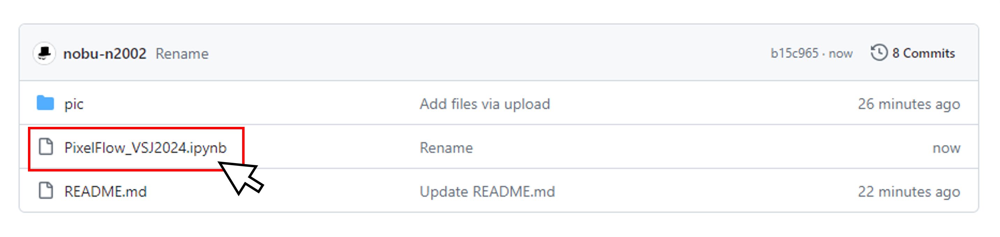
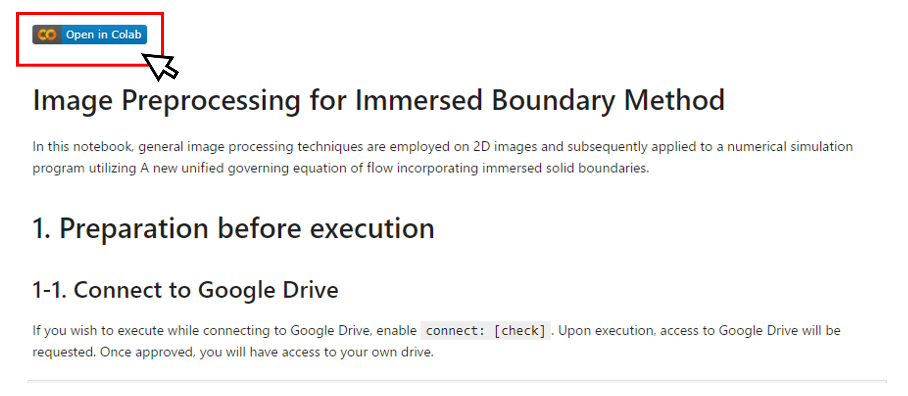

# PixelFlow－画像から直接駆動される流体シミュレーション－

    

## 概要

画像を入れると流体シミュレーションが走る．画像自体を計算格子と考えることで自由で柔軟な流体シミュレーションが可能となる．

## 使い方

1. `PixelFlow_VSJ2024.ipynb`をクリック

    

2. Open in Colaboをクリック

    

3. Colabo Note内の説明に従って実行していく

## 実行例

RGB画像を入力として，余白の追加やグレースケール化，しきいち処理などを行い，境界を拡散フィルタにより滑らかにする．得られた分布を直接パラメータとして流体ソルバーで読み込むことにより流れ計算が実行できる．

    

## 実行の様子

実行の様子は[コチラ](https://www.youtube.com/watch?v=3wAnzVv3cxc)
